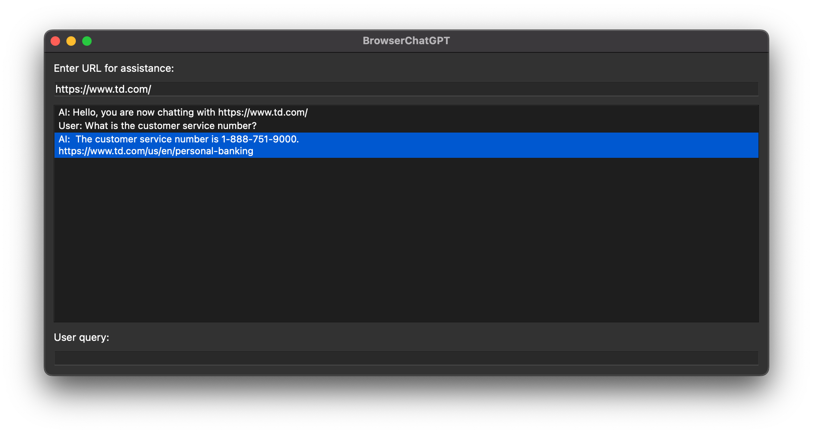

# BrowserChatGPT
BrowserChatGPT is your intelligent web companion, seamlessly integrating into your browser to provide real-time chatbot-like assistance and answers, ensuring you always have a chatbot helping you regardless of whether a website has its own.

## Table of Contents

- [BrowserChatGPT](#browserchatgpt)
  - [Table of Contents](#table-of-contents)
  - [Components](#components)
  - [Getting Started](#getting-started)
    - [Prerequisites](#prerequisites)
    - [Installation](#installation)
  - [FAQ](#faq)

## Components

The BrowserChatGPT app is comprised of the following components:

1. **apps/**: This folder houses the files necessary to render the actual app. Currently, we are use PyQt5 to render a small GUI where the user can interact with our LLM.

2. **browserchatgpt/**: This folder houses the main functionality that allows us to scrape data from a input website efficiently, store that data, and utilize an LLM to allow users to interact with that data.

   - `web_cache.py`: Database cache of web data to store most recently visited URLs.
   - `web_llm.py`: Implementation of LangChain LLM ([RetrievalQAWithSourcesChain](https://api.python.langchain.com/en/latest/chains/langchain.chains.qa_with_sources.retrieval.RetrievalQAWithSourcesChain.html))
   - `web_scraper_concurrent.py`: Efficient web scraper for concurrent scraping of websites and subpages.
   - `web_vector_store.py`: FAISS database to store scraped data / embeddings.

3. **chrome-extension/**: WIP code for packaging this application as a chrome extension.

4. **tests/**: Integration tests for components in this application.

## Getting Started

### Prerequisites

Before you begin, ensure you have met the following requirements:

- You have [Python 3.9+](https://www.python.org/) installed.
- You have created an [OpenAI API Key](https://gptforwork.com/help/gpt-for-docs/setup/create-openai-api-key).

### Installation

1. Clone the repository:

    ```bash
    git@github.com:Ngrieco/BrowserChatGPT.git
    ```

2. Install virtualenv:

    ``` bash
    pip install virtualenv
    ```

3. Navigate to the root folder:
   
    ``` bash
    cd BrowserChatGPT/
    ```

4. Set up your virtual environment and set your OpenAI API Key:

    ``` bash
    virtualenv llmenv -p $(which python3.9)
    source llenv/bin/activate
    pip install -e .
    export OPENAI_API_KEY="YOUR_API_KEY_HERE"
    ```

5. Run the application:

    ``` bash
    python3.9 apps/chat_app.py
    ```

6. At this point, you should see a GUI open prompting you to input a website for which you want some help on! Enjoy!

    

7. To deactivate your virtual environment:
   
   ``` bash
   deactivate
   ```

## FAQ

1. **I exported my OPENAI_API_KEY to my virtual environment, but the application still isn't working. What should I do?**

    If this is an issue for you, you can try one of two things. 
    
    First off, you can navigate out of your virtual environment and export your OpenAI API Key to your global environment.

    ``` bash
    export OPENAI_API_KEY="YOUR_API_KEY_HERE"
    ```

    If that does not work either, you can add your OPENAI_API_KEY to your `~/.bashrc` file. The `~/.bashrc` is configuration file for the bash shell, which is the default on most Linux systems.

    Use nano or vim to open and edit your `~/.bashrc` file.
    ``` bash
    nano ~/.bashrc
    ```
    Add the following text to your `~/.bashrc` file.
    
    ``` bash
    export OPENAI_API_KEY="YOUR_API_KEY_HERE"
    ```
    If using nano, you can use Ctrl^O to save and Ctrl^X to exit.
